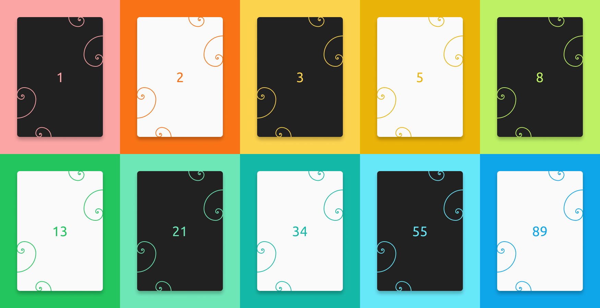

# Fibonacci Card 🃏

> 1.1.1

I made a simple and colorful application (#ForTheLulz) based on the **Fibonnaci** sequence, for all your user stories (random) evaluation in a **Scrum** process.

This app is powered by [SvelteJS](https://svelte.dev/).

## Preview



## Process

Repository:

```
git clone https://github.com/MrDoomy/FibonacciCard.git
```

Install:

```
yarn install
```

Dev:

```
yarn dev
```

Build:

```
yarn build
```

Enjoy! 👌

### Tips

Try to reduce the **Fibonnaci** sequence using `urlSearchParam` :
- [fibonacci-card.vercel.app/?limit=55](https://fibonacci-card.vercel.app/?limit=55)
- 
Try the "_script_" mode using `urlSearchParam` :
- [fibonacci-card.vercel.app/?mode=script](https://fibonacci-card.vercel.app/?mode=script)

## License

```
"THE BEER-WARE LICENSE" (Revision 42):
<phk@FreeBSD.ORG> wrote this file. As long as you retain this notice you
can do whatever you want with this stuff. If we meet some day, and you think
this stuff is worth it, you can buy me a beer in return. Damien Chazoule
```
